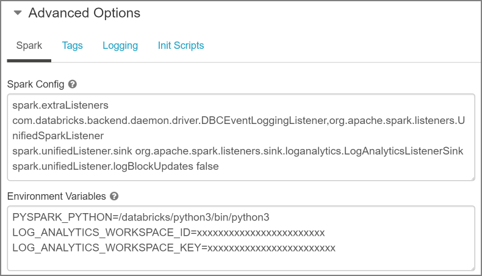
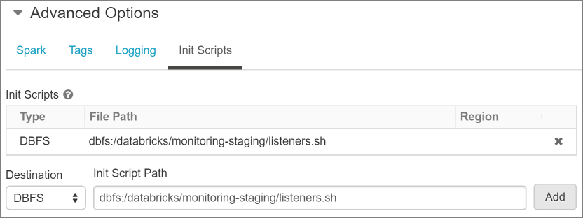
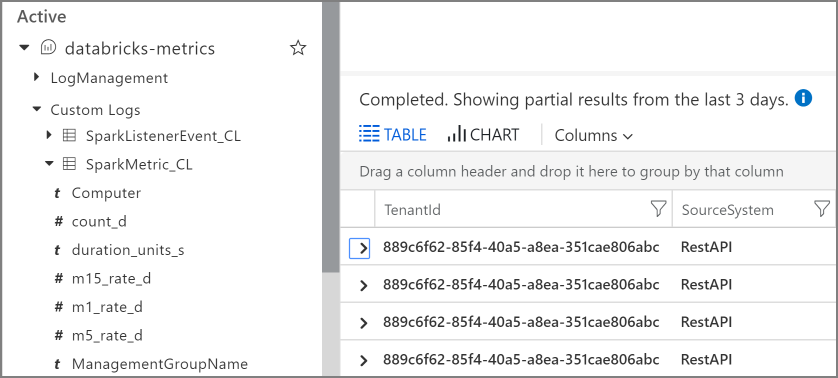

<!-- markdownlint-disable MD040 -->

# Configure Azure Databricks to send metrics to Azure Monitor

This article shows how to configure an Azure Databricks cluster to send metrics to a [Log Analytics workspace](/azure/azure-monitor/platform/manage-access). It uses the [Azure Databricks Monitoring Library](https://github.com/mspnp/spark-monitoring), which is available on GitHub. Understanding of Java, Scala, and Maven are recommended as prerequisistes.

## About the Azure Databricks Monitoring Library

The [GitHub repo](https://github.com/mspnp/spark-monitoring) for the Azure Databricks Monitoring Library has following directory structure:

```
/src  
    /spark-jobs  
    /spark-listeners-loganalytics  
    /spark-listeners  
    /pom.xml  
```

The **spark-jobs** directory is a sample Spark application demonstrating how to implement a Spark application metric counter.

The **spark-listeners** directory includes functionality that enables Azure Databricks to send Apache Spark events at the service level to an Azure Log Analytics workspace. Azure Databricks is a service based on Apache Spark, which includes a set of structured APIs for batch processing data using Datasets, DataFrames, and SQL. With Apache Spark 2.0, support was added for [Structured Streaming](https://spark.apache.org/docs/latest/structured-streaming-programming-guide.html), a data stream processing API built on Spark's batch processing APIs.

The **spark-listeners-loganalytics** directory includes a sink for Spark listeners, a sink for DropWizard, and a client for an Azure Log Analytics Workspace. This directory also includes a log4j Appender for your Apache Spark application logs.

The **spark-listeners-loganalytics** and **spark-listeners** directories contain the code for building the two JAR files that are deployed to the Databricks cluster. The **spark-listeners** directory includes a **scripts** directory that contains a cluster node initialization script to copy the JAR files from a staging directory in the Azure Databricks file system to execution nodes.

The **pom.xml** file is the main Maven build file for the entire project.

## Prerequisites

To get started, deploy the following Azure resources:

- An Azure Databricks workspace. See [Quickstart: Run a Spark job on Azure Databricks using the Azure portal](/azure/azure-databricks/quickstart-create-databricks-workspace-portal).
- A Log Analytics workspace. See [Create a Log Analytics workspace in the Azure portal](/azure/azure-monitor/learn/quick-create-workspace).

Next, install the [Azure Databricks CLI](https://docs.databricks.com/user-guide/dev-tools/databricks-cli.html#install-the-cli). An Azure Databricks personal access token is required to use the CLI. For instructions, see [Generate a token](https://docs.azuredatabricks.net/api/latest/authentication.html#token-management).

Find your Log Analytics workspace ID and key. For instructions, see [Obtain workspace ID and key](/azure/azure-monitor/platform/agent-windows#obtain-workspace-id-and-key). You will need these values when you configure the Databricks cluster.

To build the monitoring library, you will need a Java IDE with the following resources:

- [Java Development Kit (JDK) version 1.8](http://www.oracle.com/technetwork/java/javase/downloads/index.html)
- [Scala language SDK 2.11](https://www.scala-lang.org/download/)
- [Apache Maven 3.5.4](http://maven.apache.org/download.cgi)

## Build the Azure Databricks Monitoring Library

To build the Azure Databricks Monitoring Library, perform the following steps:

1. Clone, fork, or download the [GitHub repository](https://github.com/mspnp/spark-monitoring).

1. Import the Maven project object model file, _pom.xml_, located in the **/src** folder into your project. This will import three projects:

    - spark-jobs
    - spark-listeners
    - spark-listeners-loganalytics

1. Execute the Maven **package** build phase in your Java IDE to build the JAR files for each of these projects:

    |Project| JAR file|
    |-------|---------|
    |spark-jobs|spark-jobs-1.0-SNAPSHOT.jar|
    |spark-listeners|spark-listeners-1.0-SNAPSHOT.jar|
    |spark-listeners-loganalytics|spark-listeners-loganalytics-1.0-SNAPSHOT.jar|

1. Use the Azure Databricks CLI to create a directory named **dbfs:/databricks/monitoring-staging**:  

    ```bash
    dbfs mkdirs dbfs:/databricks/monitoring-staging
    ```

1. Use the Azure Databricks CLI to copy **/src/spark-listeners/scripts/listeners.sh** to the directory previously:

    ```bash
    dbfs cp ./src/spark-listeners/scripts/listeners.sh dbfs:/databricks/monitoring-staging/listeners.sh
    ```

1. Use the Azure Databricks CLI to copy **/src/spark-listeners/scripts/metrics.properties** to the directory created previously:

    ```bash
    dbfs cp <local path to metrics.properties> dbfs:/databricks/monitoring-staging/metrics.properties
    ```

1. Use the Azure Databricks CLI to copy **spark-listeners-1.0-SNAPSHOT.jar** and **spark-listeners-loganalytics-1.0-SNAPSHOT.jar** to the directory created previously:

    ```bash
    dbfs cp ./src/spark-listeners/target/spark-listeners-1.0-SNAPSHOT.jar dbfs:/databricks/monitoring-staging/spark-listeners-1.0-SNAPSHOT.jar
    dbfs cp ./src/spark-listeners-loganalytics/target/spark-listeners-loganalytics-1.0-SNAPSHOT.jar dbfs:/databricks/monitoring-staging/spark-listeners-loganalytics-1.0-SNAPSHOT.jar
    ```

## Create and configure an Azure Databricks cluster

To create and configure an Azure Databricks cluster, follow these steps:

1. Navigate to your Azure Databricks workspace in the Azure portal.
1. On the home page, click **New Cluster**.
1. Enter a name for your cluster in the **Cluster Name** text box.
1. In the **Databricks Runtime Version** dropdown, select **4.3** or greater.
1. Under **Advanced Options**, click on the **Spark** tab. Enter the following name-value pairs in the **Spark Config** text box:

    ```
    spark.extraListeners com.databricks.backend.daemon.driver.DBCEventLoggingListener,org.apache.spark.listeners.UnifiedSparkListener
    spark.unifiedListener.sink org.apache.spark.listeners.sink.loganalytics.LogAnalyticsListenerSink
    spark.unifiedListener.logBlockUpdates false
    ```

1. While still under the **Spark** tab, enter the following values in the **Environment Variables** text box:

    ```
    LOG_ANALYTICS_WORKSPACE_ID=[your Azure Log Analytics workspace ID]
    LOG_ANALYTICS_WORKSPACE_KEY=[your Azure Log Analytics workspace key]
    ```

    

1. While still under the **Advanced Options** section, click on the **Init Scripts** tab.
1. In the **Destination** dropdown, select **DBFS**.
1. Under **Init Script Path**, enter `dbfs:/databricks/monitoring-staging/listeners.sh`.
1. Click **Add**.

    

1. Click **Create Cluster** to create the cluster.

## View metrics

After you complete these steps, your Databricks cluster streams some metric data about the cluster itself to Azure Monitor. This log data is available in your Azure Log Analytics workspace under the "Active | Custom Logs | SparkMetric_CL" schema. For more information about the types of metrics that are logged, see [Metrics Core](https://metrics.dropwizard.io/4.0.0/manual/core.html) in the Dropwizard documentation. The metric type, such as gauge, counter, or histogram, is written to the Type field.

In addition, the library streams Apache Spark level events and Spark Structured Streaming metrics from your jobs to Azure Monitor. You don't need to make any changes to your application code for these events and metrics. Spark Structured Streaming log data is available under the "Active | Custom Logs | SparkListenerEvent_CL" schema.



For more information about viewing logs, see [Viewing and analyzing log data in Azure Monitor](/azure/azure-monitor/log-query/portals).

## Next steps

This article described how to configure your cluster to send metrics to Azure Monitor. The next article shows how to use the Azure Databricks Monitoring Library to send application metrics and logs.

> [!div class="nextstepaction"]
> [Send application logs to Azure Monitor](./application-logs.md)
