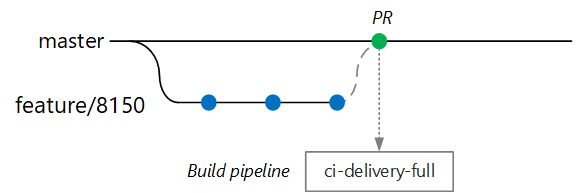
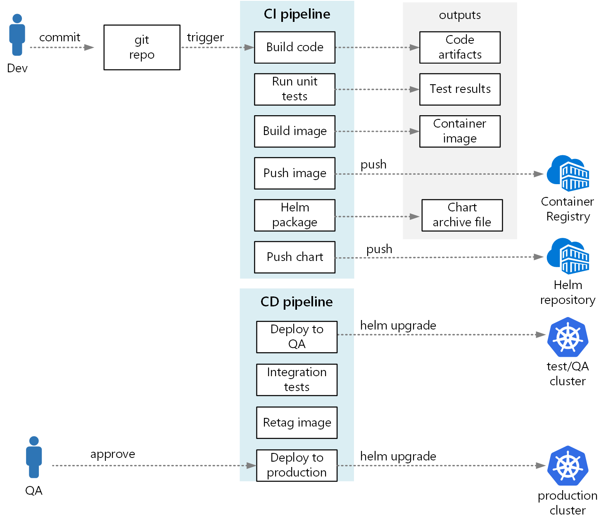

# CI/CD for microservices on Kubernetes

This article describes a proven CI/CD process for deploying microservices to Azure Kubernetes Service (AKS).

This pipeline uses [Azure Pipelines](/azure/devops/pipelines/?view=azure-devops) to build, test, and deploy microservices to AKS. The container images for the microservices are stored in [Azure Container Registry](/azure/container-registry/). However, the basic approach described here can work with other tools and services such as Jenkins and Docker Hub.

Before reading this article, consider reading [CI/CD for microservices architectures](./ci-cd) to understand the goals and challenges that this pipeline attempts to meet. These goals can be summarized as follows:

- Teams can build and deploy their services independently.
- 
- Quality gates are enforced at each stage of the pipeline.
- 

Let's start by looking at the overall flow of the pipeline.

## Overview of the CI/CD process

In this section, we present a possible CI/CD workflow, based on the following assumptions:

- The code repository is a monorepo, with folders organized by microservice.
- The team's branching strategy is based on [trunk-based development](https://trunkbaseddevelopment.com/).
- The team uses [namespaces](/azure/container-registry/container-registry-best-practices#repository-namespaces) in Azure Container Registry to isolate images that are approved for production from images that are still being tested.
- The team uses Helm charts to package each microservice.

In this example, a developer is working on a microservice called Delivery Service. While developing a new feature, the developer checks code into a feature branch.


Pushing commits to this branch tiggers a CI build for the microservice. By convention, feature branches are named `feature/*`. The build definition file includes a trigger that filters by the branch name and the source path:

```yaml
trigger:
  batch: true
  branches:
    include:
    - master
    - feature/*
    - topic/*

    exclude:
    - feature/experimental/*
    - topic/experimental/*

  paths:
     include:
     - /src/shipping/delivery/
```

(You can find the complete file [here](https://github.com/mspnp/microservices-reference-implementation/blob/master/src/shipping/delivery/azure-pipelines-validation.yml).)

 Using this approach, each team can have its own build pipeline. Only code that is checked into the `/src/shipping/delivery` folder triggers a build of the Delivery Service. At this point in the workflow, the CI build runs some minimal code verification:

1. Build the code
1. Run unit tests

The goal is to keep build times short, so the developer can get quick feedback. Once the feature is ready to merge into master, the developer opens a PR. This triggers another CI build that performs some additional checks:

1. Build the code
1. Run unit tests
1. Build the runtime container image
1. Run vulnerability scans on the image



> [!NOTE]
> In Azure Repos, you can define [policies](/azure/devops/repos/git/branch-policies) to protect branches. For example, the policy could require a successful CI build plus a sign-off from an approver in order to merge into master.

At some point, the team is ready to deploy a new version of the Delivery service. To do so, the release manager creates a branch from master with this naming pattern: `release/<microservice name>/<semver>`. For example, `release/delivery/v1.0.2`.

Creation of this branch triggers a full CI build that runs all the previous steps plus:

1. Push the container image to Azure Container Registry. The image is tagged with the version number taken from the branch name.
2. Run `helm package` to package the Helm chart
3. Push the Helm package to Container Registry by running `az acr helm push`.

Assuming this build succeeds, it triggers a deployment (CD) process using an Azure Pipelines [release pipeline](/azure/devops/pipelines/release/what-is-release-management). This pipeline 

1. Run `helm upgrade` to deploy the Helm chart to a QA environment.
1. An approver signs off before the package moves to production. See [Release deployment control using approvals](/azure/devops/pipelines/release/approvals/approvals).
1. Re-tag the Docker image for the production namespace in Azure Container Registry. For example, if the current tag is `myrepo.azurecr.io/delivery:v1.0.2`, the production tag is `myrepo.azurecr.io/prod/delivery:v1.0.2`.
1. Run `helm upgrade` to deploy the Helm chart to the production environment.


Even in a monorepo, these tasks can be scoped to individual microservices, so that teams can deploy with high velocity. The process has some manual steps: Approving PRs, creating release branches, and approving deployments into the production cluster. These steps are manual by policy &mdash; they could be completely automated if the organization prefers.

## Docker recommendations

When possible, package your build process into a container. That allows you to build your code artifacts using Docker, without needing to configure the build environment on each build machine. 

A containerized build process makes it easy to scale out the CI pipeline by adding new build agents. Also, any developer on the team can build the code simply by running the build container.

Using multi-stage builds in Docker, you can define the build environment and the runtime image in a single Dockerfile.

For example, here's a Dockerfile that builds an ASP.NET Core application:

```
FROM microsoft/dotnet:2.2-runtime AS base
WORKDIR /app

FROM microsoft/dotnet:2.2-sdk AS build
WORKDIR /src/Fabrikam.Workflow.Service

COPY Fabrikam.Workflow.Service/Fabrikam.Workflow.Service.csproj .
RUN dotnet restore Fabrikam.Workflow.Service.csproj

COPY Fabrikam.Workflow.Service/. .
RUN dotnet build Fabrikam.Workflow.Service.csproj -c Release -o /app

FROM build AS publish
RUN dotnet publish Fabrikam.Workflow.Service.csproj -c Release -o /app

FROM base AS final
WORKDIR /app
COPY --from=publish /app .
ENTRYPOINT ["dotnet", "Fabrikam.Workflow.Service.dll"]
```

This Dockerfile defines several build stages. Notice that the stage named `base` uses the ASP.NET Core runtime, while the stage named `build` uses the full ASP.NET Core SDK. The `build` stage is used to build the ASP.NET Core project. But the final runtime container is built from `base`, contains just the runime and is significantly smaller than the full SDK image.

Another good practice is to run unit tests in the container. For example, here is part of a Dockerfile that builds a test runner. A developer can run the test runner locallty, and the automated CI process can run the same tests.

```
FROM build AS testrunner
WORKDIR /src/tests

COPY Fabrikam.Workflow.Service.Tests/*.csproj .
RUN dotnet restore Fabrikam.Workflow.Service.Tests.csproj

COPY Fabrikam.Workflow.Service.Tests/. .
ENTRYPOINT ["dotnet", "test", "--logger:trx"]
```

A developer can use this Dockerfile to run the tests locally:

```bash
docker build . -t delivery-test:1 --target=testrunner
docker run -p 8080:8080 delivery-test:1
```

Here are some other best practices to consider with resepct to containers:

- Define organization-wide conventions for container tags, versioning, and naming conventions for resources deployed to the cluster (pods, services, and so on). That can make it easier to diagnose deployment issues.

- Use specific container version tags, not `latest`.

- Create two separate container registries, one for development/testing and one for production. Don't push an image to the production registry until you're ready to deploy it into production. If you combine this practice with semantic versioning of container images, it can reduce the chance of accidentally deploying a version that wasn't approved for release.

- Follow the principle of least privilege by running containers as a nonprivileged user. In Kubernetes, you can create a pod security policy that prevents containers from running as *root*. See [Prevent Pods From Running With Root Privileges](https://docs.bitnami.com/kubernetes/how-to/secure-kubernetes-cluster-psp/)

## Helm charts

Consider using Helm to manage building and deploying services. Some of the features of Helm that help with CI/CD include:

- Organizing all of the Kubernetes objects for a particular microservice into a single Helm chart.
- Deploying the chart as a single Helm command, rather than a series of kubectl commands.
- Charts are explicitly versioned. Use Helm to release a version, view releases, and roll back to a previous version. Tracking updates and revisions, using semantic versioning, along with the ability to roll back to a previous version.
- The use of templates to avoid duplicating information, such as labels and selectors, across many files.
- Managing dependencies between charts.
- Charts can be stored in a Helm repository, such as Azure Container Registry, and integrated into the build pipeline.

For more information about using Container Registry as a Helm repository, see [Use Azure Container Registry as a Helm repository for your application charts](/azure/container-registry/container-registry-helm-repos).

A single microservice may involve multiple k8s configuration files. Updating a service can mean touching all of these files to uppate selectors, labels, and image tags. Helm treats these as a single package called a chart and allows you to easily update the YAML files by using variables. Helm uses a template language (based on Go templates) to let you write parameterized YAML configuration files.

For example, from the command line:

```bash
helm install $HELM_CHARTS/package/ \
     --set image.tag=0.1.0 \
     --set image.repository=package \
     --set dockerregistry=$ACR_SERVER \
     --namespace backend \
     --name package-v0.1.0
```

Now you can reference these in the spec. For example, here's part of a YAML file that defines a deployment:

```yaml
apiVersion: apps/v1beta2
kind: Deployment
metadata:
  name: {{ include "package.fullname" . | replace "." "" }}
  labels:
    app.kubernetes.io/name: {{ include "package.name" . }}
    app.kubernetes.io/instance: {{ .Release.Name }}
  annotations:
    kubernetes.io/change-cause: {{ .Values.reason }}

...

  spec:
      containers:
      - name: &package-container_name fabrikam-package
        image: {{ .Values.dockerregistry }}/{{ .Values.image.repository }}:{{ .Values.image.tag }}
        imagePullPolicy: {{ .Values.image.pullPolicy }}
        env:
        - name: LOG_LEVEL
          value: {{ .Values.log.level }}
```

Although your CI/CD pipeline could simply install a chart directly to Kubernetes, we recommend creating a chart archive (.tgz file) and pushing the chart to a Helm repository such as Azure Container Registry. 

For more information, see [Package Docker-based apps in Helm charts in Azure Pipelines](/azure/devops/pipelines/languages/helm?view=azure-devops)

### Managing revisions with Helm

>[!TIP]
> Use the `--history-max` flag when initializing Helm. This setting limits the number of revisions that Tiller saves in its history. Tiller stores revision history in configmaps. If you're releasing updates frequently, the configmaps can grow very large unless you limit the history size.

Blue-green deployment with Helm and Kubernetes

This approach uses selectors to swap between the old and new versions of a microservice. The 

In the deployment,

  selector:
    app.kubernetes.io/name: {{ template "delivery.name" . }}
    app.kubernetes.io/instance: {{ .Release.Name }}

## Azure DevOps Pipeline


-	Trigger(s)
o	GitHub PR (see ‘pr’ trigger)
o	Commits (filtered by branches and/or paths)


The following diagram shows the end-to-end CI and CD pipelines:



Tasks in the CI job:
-	Build the testrunner container
-	Run the tests, by invoking docker run against the testrunner container
-	Publish the test results
o	See here: https://docs.microsoft.com/en-us/azure/devops/pipelines/languages/docker?view=azure-devops&tabs=yaml
-	Build the runtime image
-	Push to ACR (or other container registry)
-	Install Helm on the agent, using HelmInstaller and HelmDeploy tasks. (For CI, the HelmDeploy task runs ‘helm init --client-only to set up the Helm client on the agent. You could also use this task to install Tiller on the cluster when creating a new cluster environment.)
-	Package the Helm chart 
-	Push the Helm package to ACR (or other Helm repository)
